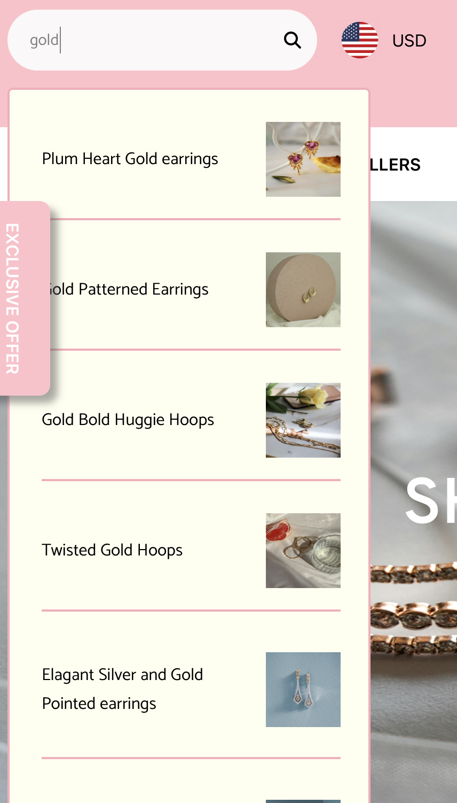
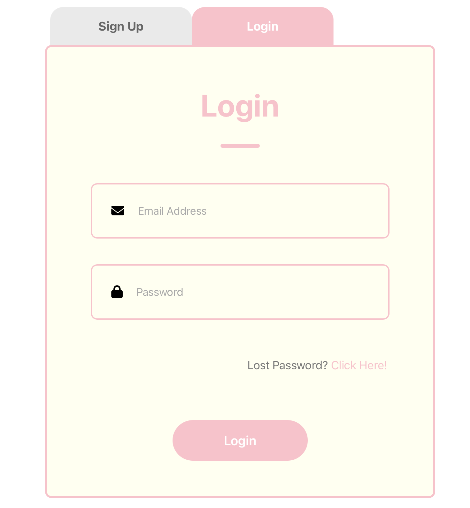
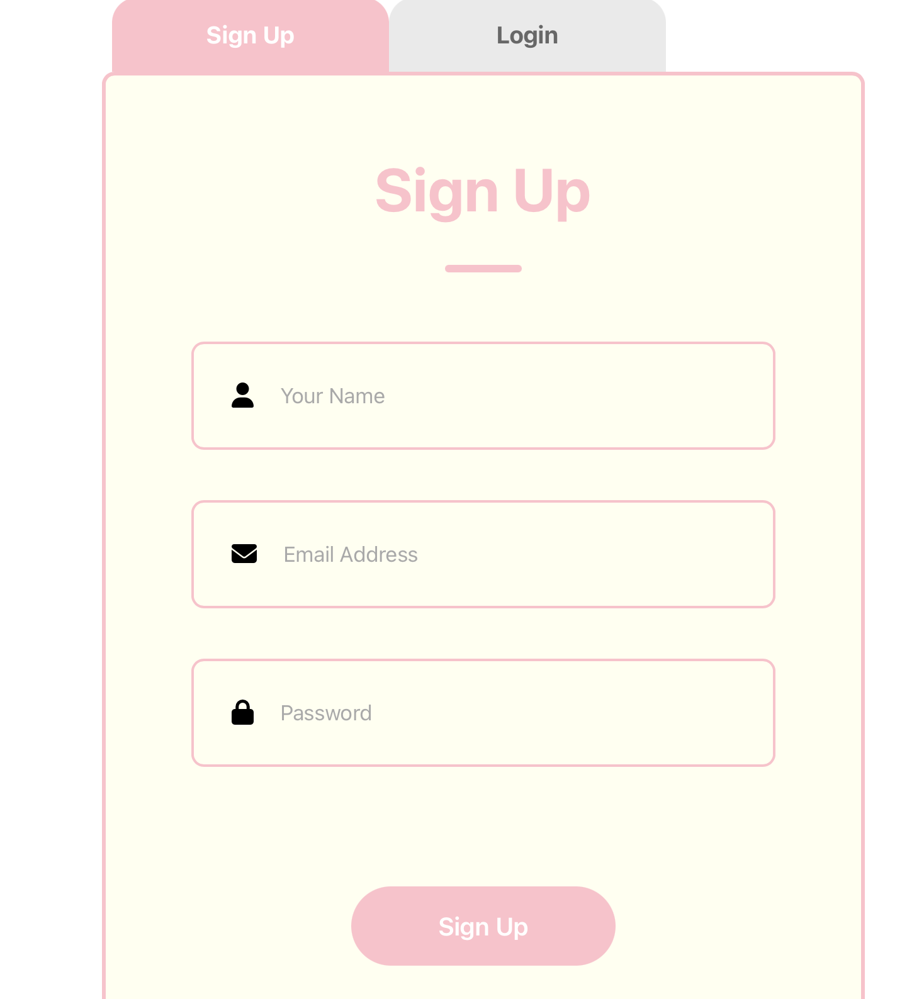

## Project Title
Jewerly e-commerce website named "Mini Gold"

## Description
Mini Gold is a jewelry e-commerce website where you can order all the dainty and modern jewelry, including earrings, necklaces, and bracelets, online.

## Table of Contents
- [Installation](#installation)
- [Features](#Features)

## Installation
1. Clone the repository:
   ```
   https://mini0222.github.io/Jewelry-e-commerce-website/
   ```
   
2. Install dependencies:
   ```
   npm install
   ```
   
3. Start the development server:
   ```
   npm start
   ```

## Features

- Users will see an exclusive offer pop-up each time they refresh the website or click on the shop link.


- Users can browse items by clicking on the categories listed in the navigation bar.

- Users can find specific items by typing their name or keywords into the search bar located on the left side of the navigation bar.


  
- Users will automatically see each banner change every 3 seconds, or they can manually switch banners by clicking on the dots at the bottom of the banner.

https://github.com/mini0222/Jewelry-e-commerce-website/assets/142453034/5a2f0785-2180-465a-b089-a95296b4df4b

- Users can slide right and left to see some of new arrivals and bestsellers by scrolling or by clicking the left/right arrow button on the top right of the section.

https://github.com/mini0222/Jewelry-e-commerce-website/assets/142453034/2944760d-360d-41b6-ba35-819e72593669

- Users can add favorite items to their wishlist by clicking the heart icon above the product picture.

https://github.com/mini0222/Jewelry-e-commerce-website/assets/142453034/68b84687-0ff9-47f1-8d6a-8d0879041743

- Users can select a jewelry size and add it to their cart.

https://github.com/mini0222/Jewelry-e-commerce-website/assets/142453034/19f2ddf1-f3ec-4b43-9cb5-a6d47dfcf9d3

- Users have the option to sign up or sign in.




  


