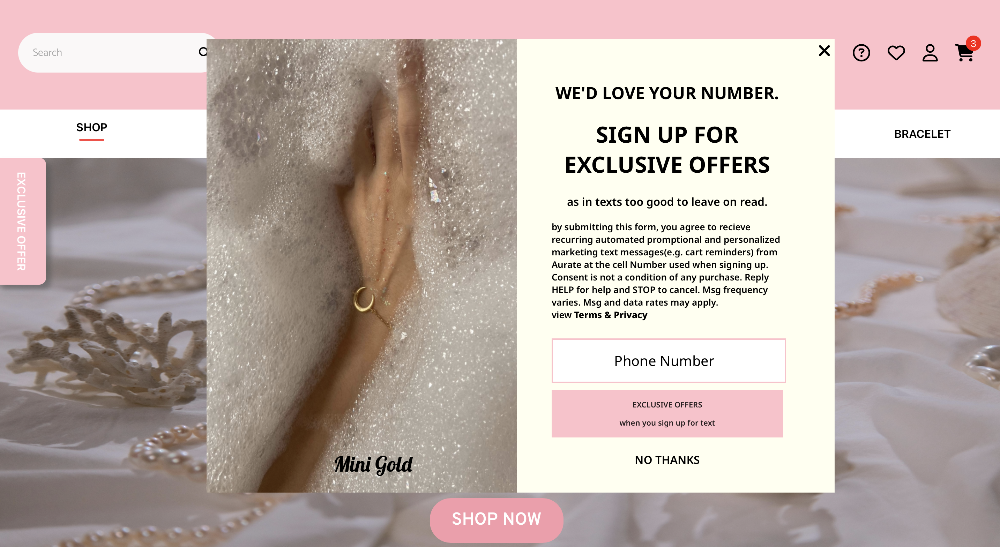
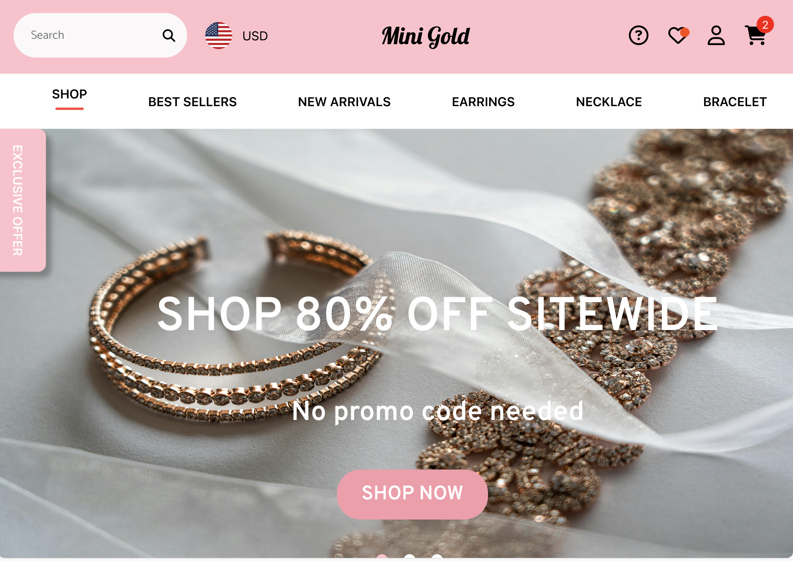
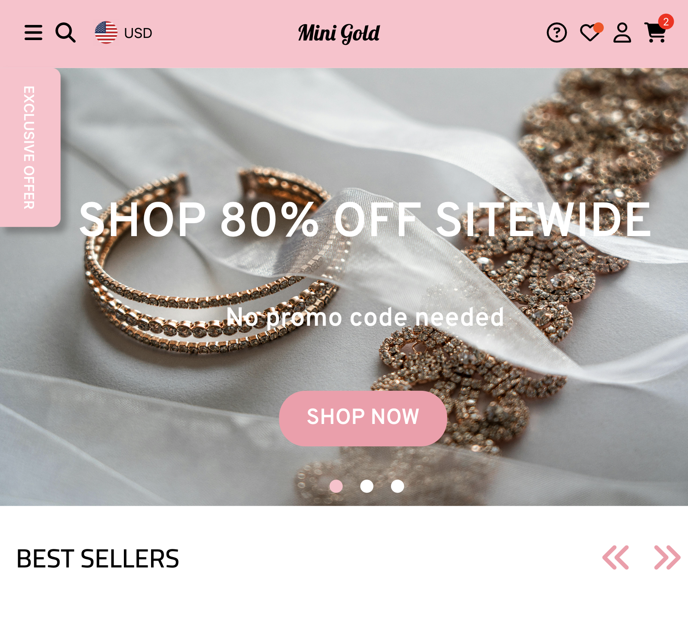
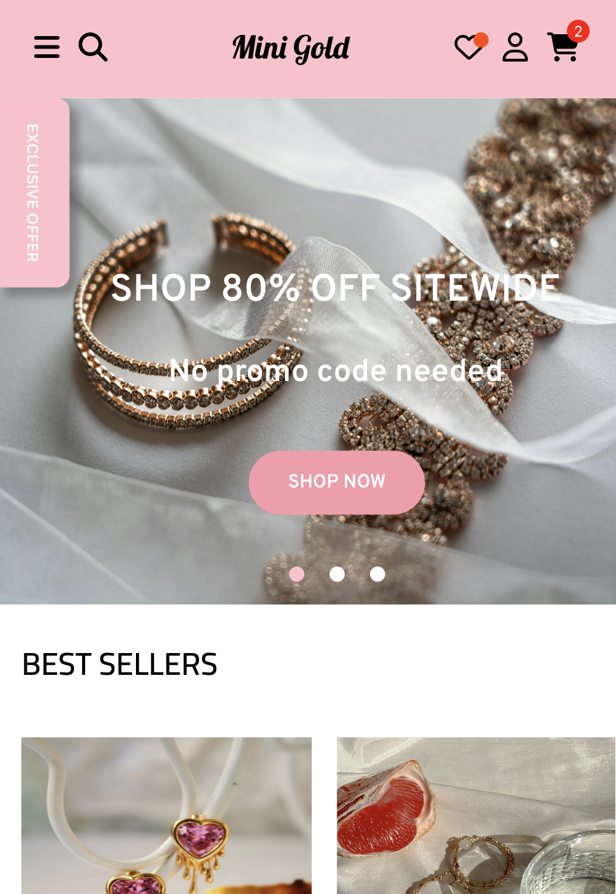
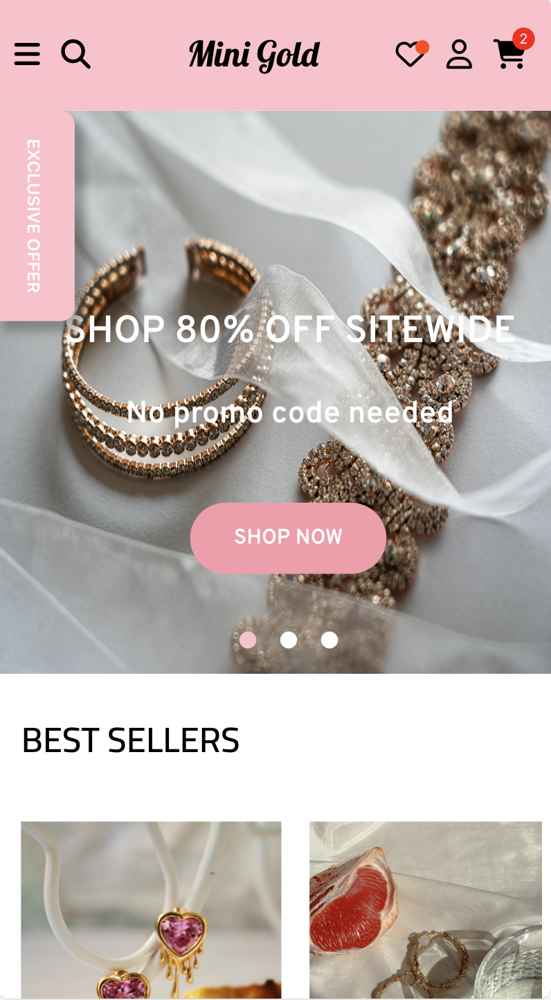

## Project Title
Jewerly e-commerce website named "Mini Gold"

## Description
Mini Gold is a jewelry e-commerce website where you can order all the dainty and modern jewelry, including earrings, necklaces, and bracelets, online.

## Table of Contents
- [Installation](#installation)
- [Features](#Features)
- [Responsive Design Breakpoint](#ResponsiveDesignBreakpoint)
- [Responsive Navigation and Search](#ResponsiveNavigationandSearch)

## Installation
1. Clone the repository:
   ```
   https://mini0222.github.io/Jewelry-e-commerce-website/
   ```
   
2. Install dependencies:
   ```
   npm install
   ```
   
3. Start the development server:
   ```
   npm start
   ```

## Features

- Users will see an exclusive offer pop-up each time they refresh the website or click on the shop link.



- Users can browse items by clicking on the categories listed in the navigation bar.

- Users can find specific items by typing their name or keywords into the search bar located on the left side of the navigation bar.


  
- Users will automatically see each banner change every 3 seconds, or they can manually switch banners by clicking on the dots at the bottom of the banner.

https://github.com/mini0222/Jewelry-e-commerce-website/assets/142453034/5a2f0785-2180-465a-b089-a95296b4df4b

- Users can slide right and left to see some of new arrivals and bestsellers by scrolling or by clicking the left/right arrow button on the top right of the section.

https://github.com/mini0222/Jewelry-e-commerce-website/assets/142453034/2944760d-360d-41b6-ba35-819e72593669

- Users can add favorite items to their wishlist by clicking the heart icon above the product picture.

https://github.com/mini0222/Jewelry-e-commerce-website/assets/142453034/68b84687-0ff9-47f1-8d6a-8d0879041743

- Users can select a jewelry size and add it to their cart.

https://github.com/mini0222/Jewelry-e-commerce-website/assets/142453034/19f2ddf1-f3ec-4b43-9cb5-a6d47dfcf9d3

- Users have the option to sign up or sign in.


## Responsive Design Breakpoint

- 1280px
  
At 1280px, the website layout is optimized for larger desktop screens.
Navigation manus and content sections are arranged for maximum visibility and ease of access.


- 1024px

The design gracefully adapts to screen with a width of 1024px,
commonly fount on smaller desktop monitors and some tablets. Elements are resized and repositioned to maintain readability and usability.



- 800px

When viewd on screens with a width of 800px, such as older desktop monitors or tablets in landscape mode, 
the website adjusts its layout to ensure that all content remains accessible without horizontal scrolling.



- 500px

At 500px, the design caters to smaller tablets and larger smartphones in landscape mode.
Navigation elements may be collapsed or repositioned to conserve space while maintaining functionality.



- 400px

Finally, the website is optimized for screens as narrow as 400px, typical of smartphones in portrait mode.
Content is prioritized, and the layout is simplified to accommodate smaller screens without sacrificing usability.

-

## Responsive Navigation and Search

- 800px ~ 400px

at 800px and 500px,400px screen widths, the main page features a hidden menu navigation, accessible by clicking the three lines icon on the left side of the navigation bar. When activated, the menu smoothly transitions from left to right, presenting navigation options in a vertical layout.

https://github.com/mini0222/Jewelry-e-commerce-website/assets/142453034/b10aa3d7-ad52-4677-a76e-f9141552d1c9


the main page conceals the search box to declutter the interface, enhancing user focus on primary content.
however, users can easily access the search functionality by clicking the magnifying glasses icon positioned on the left of the navigation bar.

Upon activation, the search box dtnamically appears, offering users recommendaed items from the website to browse before initiating a search. Users can conveniently locate specific items by typing queries directly into the search bar, providing a seamless and intuitive search experience.

https://github.com/mini0222/Jewelry-e-commerce-website/assets/142453034/c15ab16b-bd6a-4f30-a8d0-2237cc3c841a


  


